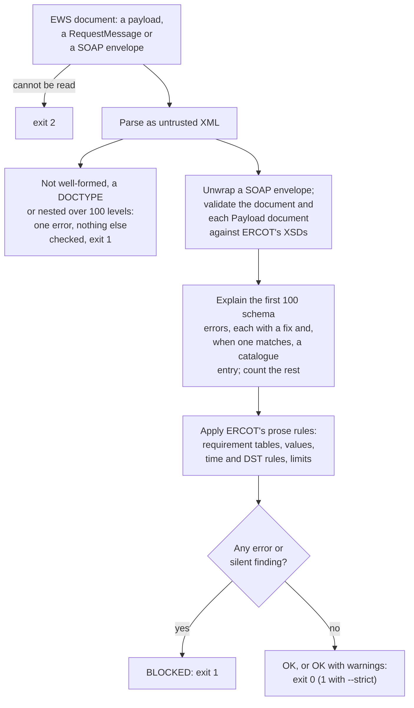

# ercot-ews-check

[](https://github.com/wattness/ercot-ews-check/actions/workflows/ci.yml) [](LICENSE) [](.github/workflows/ci.yml) [](https://huggingface.co/spaces/wattness/ercot-ews-check) [](NOTICE)

**Unofficial.** Not affiliated with or endorsed by ERCOT.

Check ERCOT External Web Services (EWS) documents before you send them, and look up the places
where ERCOT's EWS documentation disagrees with its own schemas.

<picture>
  <source media="(prefers-color-scheme: dark)" srcset="docs/img/check-broken-as-only-offer-dark.svg">
  
</picture>

ERCOT's product schemas make every payload field optional, because one schema serves create, get
and cancel. A BidSet can pass the XSD and still be rejected, or changed without an error, by the
market system. The rules that decide this are in ERCOT's prose: the per-product requirement
tables, the time and precision conventions, and the submission limits. Some of that prose is
wrong. This tool validates against ERCOT's XSDs, then applies the prose rules, and points a
failure at a catalogued discrepancy when the entry is about the same element and the same kind of
error.

## Quickstart

To check one document without installing anything, open
[Would ERCOT reject this file?](https://huggingface.co/spaces/wattness/ercot-ews-check), a page that
runs this checker in your browser; the document is not uploaded.

Python 3.10 or later. Run these from the repository root. The checks need no ERCOT credentials,
and after installation they run offline: ERCOT's schemas and the pages they read are vendored in
[`vendor/`](vendor/).

```sh
git clone https://github.com/wattness/ercot-ews-check && cd ercot-ews-check
python3 -m venv .venv && . .venv/bin/activate    # Windows: .venv\Scripts\activate
python -m pip install .
ercot-ews-check check examples/energy-only-offer.xml
ercot-ews-check check examples/broken/as-only-offer.xml
ercot-ews-check lookup yvalue
ercot-ews-check show D001
```

The image at the top of this page is the output of the broken example, which follows the Ancillary
Service Only Offer page's Message Element table, plus a wrong tradingDate and a 24:00 end time.

`ercot-ews-check explain FILE` prints the same findings as numbered plain-English paragraphs, each
with its fix and ERCOT source. `--json` (on `check`) prints a machine-readable report, and
`--strict` also fails on warnings.

Exit status: 0 when nothing blocks; 1 when a document breaks a stated rule, ERCOT may change it
without an error, or it is refused before checking (not well-formed, a DOCTYPE, or nested more than
100 levels); 2 when a file cannot be read or a download fails. A pipeline can stop on 1.

## How it works

`check` and `explain` take each file through the steps below. A document that fails ERCOT's XSDs
still goes through the prose rules; only a document refused at the parsing step stops there, with
one finding.



## What it checks

`check` accepts a bare payload (such as a `BidSet`), a `RequestMessage`, or a SOAP envelope. A
message's `Payload` is validated on its own, because `Message.xsd` lets it hold any element of
another namespace unchecked (`xsd:any processContents="skip"`).

| Rule | Severity | Finds |
|---|---|---|
| `schema` | error | Anything ERCOT's XSDs reject, explained in plain English with a fix; a report lists the first 100 schema errors and counts the rest |
| `schema-unverified` | warning | The XSDs could not be loaded, so nothing was validated |
| `missing-required-field` | error | A create without a field the product's table marks Y or K; a warning when ERCOT's own create sample leaves the field out, or for a Three-Part Offer whose curve goes below 0 MW (an Energy Storage Resource's) without `EocFipFop`, which ERCOT's Market Submission Validation Rules call "not applicable to ESRs" |
| `value-numeric-bound` | error | A value outside the bound in the table's Values column; a warning for COP `hsl` and `lsl` (D033) |
| `value-enumerated`, `value-before-trade-date` | warning | Values the table lists, where the table is not a complete rule |
| `value-ignored` | warning | A field ERCOT documents as "Value ignored if provided"; for an AS Offer's `combinedCycle`, which the Market Submission Validation Rules require for a combined-cycle Resource, the fix is to keep it there |
| `withdrawn-payload` | error | A payload RTC+B removed (`IncDecOffer`, D010) |
| `trade-date-mismatch` | error | `tradingDate` that is not the Central-time date of the payload's `startTime`, which the tables require to be a start hour "for trade date" |
| `utc-offset` | warning | An offset that is neither UTC nor the Central-time offset in force at that instant, such as `-05:00` after the November change |
| `hour-24` | error | `T24:00`, which ERCOT excludes |
| `silent-hour-rounding` | silent | A time the product's table requires on an hour boundary that is off the hour; ERCOT may round it without an error |
| `overlapping-intervals` | error | Overlapping intervals in a sequence |
| `interval-gap` | warning | A gap in a structure that tiles the day (COP status, limits and AS capacity; TPO startup and minimum-energy costs) |
| `curve-style-points` | error | `FIXED` or `VARIABLE` curves with more than one point |
| `mw-precision` | warning | MW with more than one decimal, which `MWSingleDecimal` does not enforce |
| `silent-rrs-value1-ignored` | silent | `value1` on an RRS self-arranged quantity, which ERCOT ignores |
| `cancel-every-hour`, `cop-cancel` | warning, error | A cancel mRID without an hour suffix; a COP cancel |
| `payload-too-large` | error | A BidSet of 3,000,000 bytes or more before compression; ERCOT's limit is "less than 3 Mb in size(Pre-compression)", which this tool reads as 3,000,000 bytes |
| `doctype` | error | A document type declaration (`<!DOCTYPE ...>`); ERCOT's MarkeTrak Developer Guide lists among SOAP's syntax rules "A SOAP message must NOT contain a DTD reference", which the EWS pages do not state; nothing else is checked |
| `nesting-depth` | error | Elements nested more than 100 levels deep, far deeper than ERCOT's schemas declare; a limit of this tool, not a rule ERCOT states; nothing else is checked |

Every rule other than `schema`, `schema-unverified` and `nesting-depth` names the ERCOT page it
comes from (`source` in the JSON report). "Silent" means ERCOT accepts the document and may alter
or ignore part of it. A clean report means these checks found nothing against the vendored schema
release; it does not predict acceptance, which also depends on credit and on validation ERCOT runs
after receipt.

ERCOT states more submission rules outside its EWS documentation, in the MMS Market Submission
Validation Rules ([NP4-450-M](https://www.ercot.com/mp/data-products/data-product-details?id=NP4-450-M),
version 3.2): the shape of offer and bid curves, minimum quantities, limits on bid counts and
submission windows. This tool does not apply those rules yet. It cites that document only where it
changes a finding: FIP and FOP on an Energy Storage Resource's offer, and the combined-cycle plant
name on an AS Offer.

`check` and `explain` treat every document as untrusted. A document with a DOCTYPE is refused, so
no DTD or entity text reaches a check; schemas load from local files only; and nothing is fetched,
including a schema location the document names.
[`tests/test_untrusted_input.py`](tests/test_untrusted_input.py) covers each of these.

## The discrepancy catalogue

[`discrepancies/`](discrepancies/) holds one YAML file per known disagreement between ERCOT's EWS
documentation, examples and schemas, with a stable ID. Each entry records what ERCOT says (page,
location, a short verbatim quote, URL; descriptions of a diagram or file are kept apart as
`observed`), what the schema says (file, line, rule), what to do, the terms to find it by, and
probes. [`docs/discrepancies.md`](docs/discrepancies.md) is the index, built from the YAML.

```sh
ercot-ews-check lookup plannedSart      # by element, value, product or page
ercot-ews-check show D021               # the evidence for one entry
ercot-ews-check reproduce D021          # its minimal invalid and valid documents, checked
ercot-ews-check verify                  # is each discrepancy still present in the vendored sources?
```

Each entry carries a probe on ERCOT's side (a sentence that must still be on the page, or the
sha256 of a diagram or file) and, where there is one, a pattern that must still be in the schema.
When ERCOT corrects a page, `verify` reports which probe stopped matching. `verify --live`
downloads today's copy of every source a probe reads first: the portal's search index from
developer.ercot.com, and the schemas, example files and diagrams from developer.ercot.com and the
`main` branch of ercot/api-specs.

## What it has found

Measured from this checkout by `python scripts/measure.py`; `tests/test_readme.py` fails if this
block and the script disagree.

<!-- measure:start -->
```
Sources: ercot/api-specs 7e785be, retrieved 2026-10-07
Catalogue: 34 discrepancies (26 schema-wins, 3 prose-wins, 3 neither, 2 prose-stale); 66 of 66 probes still match; 29 with a reproducer; 8 reported upstream
Portal samples: 178 distinct XML blocks on EWS pages; 98 complete documents, of which 12 fail ERCOT's own XSDs
api-specs ews/examples: 2 of 3 fail ERCOT's own XSDs (ASOnlyOffer-Example.xml, GenResParams-SOC-Example.xml)
XSD constraints extracted: 1057 (463 required, 233 enumeration, 179 order, 151 cardinality, 12 bound, 11 length, 8 pattern)
Requirement tables: 487 element rows on 29 portal pages; 134 value rules parsed, 74 stated rules left unparsed
Mutants of the 6 files in examples/: 58 break an XSD constraint (XSD catches 58, this tool's rules 7); 134 each break one of this tool's prose rules (the rule it targets catches 134, 113 of them pass the XSD; 0 survive)
Prose-rule mutants by rule: 51 required-field, 38 hour-boundary, 19 hour-24, 6 mw-precision, 6 trade-date, 6 utc-offset, 4 overlap, 2 numeric-bound, 1 curve-style, 1 rrs-value1
```
<!-- measure:end -->

The mutation test (`ercot-ews-check mutate FILE`) breaks a valid document one rule at a time.
Every prose-rule mutant targets a rule this tool implements and counts as caught only when that
rule fires, so the figure measures enforcement, not coverage of ERCOT's prose. The required-field
and bound mutants are generated from the same extracted tables the checker reads; the 74 unparsed
rules are the extraction's known gap.

`ercot-ews-check examples --invalid` lists the failing portal samples, and `ercot-ews-check rules`
prints every extracted XSD constraint with its `file:line`.

## Python

```python
from ercot_ews_check import check_file

report = check_file("examples/broken/as-only-offer.xml")
assert report.blocked
for f in report.findings:
    print(f.severity, f.rule, f.where, f.message, f.fix, f.see, f.source)
```

`ercot_ews_check.validate` runs the XSD step alone. `ercot_ews_check.discrepancies` loads the
catalogue; `dst`, `mrid` and `values` hold the hour-token, transaction-ID and value-format helpers
the checks use.

## For AI agents

[`skills/checking-ews-submissions/`](skills/checking-ews-submissions/) is an
[Agent Skill](https://agentskills.io) that checks a submission, explains each finding in plain
English and looks up discrepancies. Copy the folder into your agent's skills directory; its
setup step installs this tool if it is missing. [`AGENTS.md`](AGENTS.md) is for coding agents
working on this repository.

## Vendored ERCOT files

`vendor/ercot/` holds ERCOT's EWS folder from [ercot/api-specs](https://github.com/ercot/api-specs)
at a pinned commit, and the developer portal's search index and two diagrams, each byte-identical
to its source. `vendor/ERCOT-TERMS-OF-USE.txt` is the text of ERCOT's Website User Agreement,
extracted from the page by `scripts/fetch_vendor.py`. `vendor/MANIFEST.json` records each file's
source, retrieval date and sha256.

```sh
python scripts/fetch_vendor.py verify            # offline hash check
python scripts/fetch_vendor.py refresh           # compare with the pinned sources
python scripts/fetch_vendor.py update --commit <sha>   # move the api-specs pin
```

`refresh` and `verify --live` download from `*.ercot.com` sites, which
[ERCOT says](https://developer.ercot.com/applications/pubapi/known-limits/#geographic-rate-limiting)
may block some regions: "Currently, regions outside the United States of America are restricted."
Where a download is refused, `refresh` reports that file as unreachable and exits 1, and
`verify --live` exits 2. Vendored files are never edited; corrections live in this repository's
own code and catalogue. See [`NOTICE`](NOTICE) for ERCOT's terms and the OASIS and W3C notices.

## Related projects

- [ercot/api-specs](https://github.com/ercot/api-specs): ERCOT's API specifications; its `ews/`
  folder of XSDs, WSDLs and example files is vendored here at a pinned commit.
- [ercot/ews-client](https://github.com/ercot/ews-client): ERCOT's sample Java client. It builds a
  RequestMessage, signs it and sends it to ERCOT's test endpoint (MOTE, the Market Operations Test
  Environment); it does not validate what it sends.

A search of GitHub, npm, PyPI project names and Hugging Face on 8 October 2026, and a second pass
that also covered other code hosts and package registries, found no other public tool that checks
EWS submissions against ERCOT's XSDs and the rules in its EWS documentation. The public EWS code it
found sends messages, fetches reports, receives ERCOT's notifications or stands in for ERCOT's
endpoint in tests; some of it carries copies of ERCOT's XSDs, and none of it validates a payload
against them. The closest is a mock of ERCOT's endpoint in one project's tests, which rejects a
few malformed messages; it does not use the XSDs and applies only a few of the documented rules.
[`docs/prior-art.md`](docs/prior-art.md) has the queries, counts and limits.

## Development

```sh
python -m pip install -e ".[dev]"
pytest                                   # offline; --network also runs the download tests
ruff check . && ruff format --check .
```

## Licence

Apache-2.0; see [LICENSE](LICENSE). The vendored ERCOT, OASIS and W3C files keep their own terms; see [NOTICE](NOTICE).

## Contributing

Found an ERCOT example that fails, or a page that contradicts a schema? Open a
[discrepancy report](../../issues/new?template=discrepancy.yml). See
[CONTRIBUTING.md](CONTRIBUTING.md).
